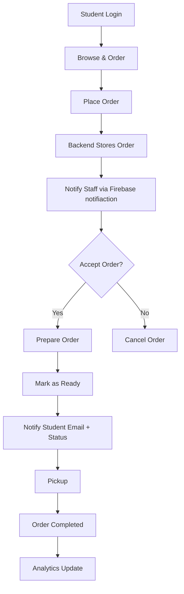

# 🍽️ Restaurant Pre-Order System

A **real-time pre-ordering platform** designed for high-traffic college cafeterias to minimize waiting time and streamline order management.

This system enables students to **pre-order food, track order status, and receive real-time notifications**, while providing the restaurant with a **lightweight CRM and analytics dashboard**.

---

## 🚀 Problem Statement

In college cafeterias:
- Students have **limited break time**
- Long queues lead to **missed orders and lost customers**
- Manual order handling causes **delays and inefficiencies**

👉 Result: **Poor user experience + revenue loss**

---

## 💡 Solution

A **digital pre-order system** where:
- Students place orders before reaching the cafe
- Kitchen staff receives instant notifications
- Orders are prepared in advance and ready on arrival

---

## 🔄 Complete System Flow (User + CRM + Backend)

## 👨‍🎓 Student Features

- Browse menu and place orders in advance  
- Real-time order status:
  - Accepted  
  - Preparing  
  - Ready  
- Email notification when order is ready  
- Order history tracking  

---

## 👨‍🍳 Restaurant / Admin Features

- Instant order notifications using Firebase  
- One-click order acceptance and workflow control  
- Order status updates (Accepted → Preparing → Ready)  
- Lightweight CRM dashboard  

---

## 📊 Analytics & Insights

- Daily and weekly order tracking  
- Category-wise performance analysis  
- Peak order time identification  
- Data-driven decision making for menu optimization  

---

## 🔔 Notification System

- Firebase Push Notifications for restaurant staff  
- Email Notifications for students when order is ready  
- Real-time status updates  

---

## 🛠️ Tech Stack

| Layer        | Technologies                     |
|--------------|---------------------------------|
| Frontend     | Next.js, Tailwind CSS          |
| Backend      | Node.js / Express.js           |
| Database     | MongoDB                        |
| Notifications| Firebase Cloud Messaging (FCM) |
| Email        | NodeMailer / Email Service     |

---

## 💼 Client Use Case

Developed for a **college-based cafe** to handle high student traffic efficiently.

### Key Outcomes:
- Reduced waiting time significantly  
- Improved order handling speed  
- Prevented customer drop-offs during peak hours  
- Streamlined kitchen workflow  

---

## 📈 Current Status

- ✅ Development Completed  
- ✅ Testing Phase Completed  
- ⏳ Deployment Pending (Client Approval)

---

## 🔮 Future Enhancements

- Online payment integration  
- QR-based pickup system  
- AI-based demand prediction  
- Multi-outlet support  
